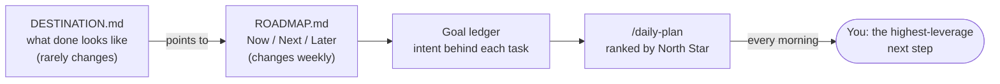
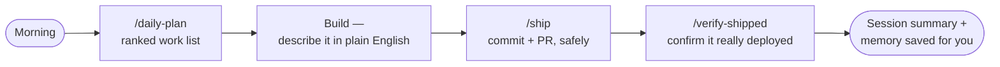

# Claude Code Project Template

> A run-once starter that turns a blank repo into a fully wired, context-aware
> AI building environment — the best of everything learned over months of
> shipping real software with Claude Code, in one place.

You open it in Claude Code, type **`/setup`**, answer a short interview, and walk
away with a project that already knows what you're building, what "done" looks
like, how to keep itself safe, how to spend AI budget wisely, and how to plan
your day. Nothing here is tied to anyone else's business — it's a blank,
white-label starter you make your own.

**Who it's for, in one line:** a *safety-first* starter for non-technical
founders building real software with Claude Code. If you're already a power
user with a workflow you love, a broad community collection may suit you better
— this box optimises for safe defaults, curation, and plain English over sheer
volume.

---

## Table of contents

1. [Is it safe to download?](#1--is-it-safe-to-download)
2. [Quick start (5 minutes)](#2--quick-start-5-minutes)
3. [The one command that does it all: `/setup`](#3--the-one-command-that-does-it-all-setup)
4. [Destination + roadmap: always in tandem](#4--destination--roadmap-always-in-tandem)
5. [The full toolkit, grouped](#5--the-full-toolkit-grouped)
6. [Your daily rhythm](#6--your-daily-rhythm)
7. [Opt-in walkthroughs (you choose)](#7--opt-in-walkthroughs-you-choose)
8. [Credentials & security, done properly](#8--credentials--security-done-properly)
9. [Staying up to date](#9--staying-up-to-date)
10. [The philosophy underneath](#10--the-philosophy-underneath)
11. [Why this is a platform, not just a pile of tools](#11--why-this-is-a-platform-not-just-a-pile-of-tools)

---

## 1 · Is it safe to download?

**Yes — safe to download and use.** This repo was security-audited before
release. Here it is in plain English:

- **No passwords or keys live in any shared file.** Every spot that needs a
  secret is a labelled blank you fill in on your own machine. Those filled-in
  files are automatically kept out of GitHub, so you can't accidentally publish
  them.
- **Nothing runs without you.** The setup script only ever *asks you* for your
  own keys and saves them privately on your own computer. It downloads nothing
  from the internet and runs nothing remote. It can't damage your machine or
  send your data anywhere.
- **The safety tools point inward, not outward.** The dozens of built-in checks
  ("hooks") exist to *stop* dangerous commands — deleting the wrong folder,
  force-pushing over someone's work, running a database query that would cost a
  fortune. They protect you; they don't do anything risky themselves.
- **You can verify it yourself.** The template ships with five security skills
  (a deep security review, a quick scan, a threat-model builder, an "agent
  shield", and a multi-tenant-auth checker). Type *"run a security review on
  this repo"* any time and Claude will audit it in front of you.
- **Watch it protect you — try this on day one.** After `/setup`, ask Claude to
  run `git push --force` or a `DELETE` without a `WHERE` clause. The guardrail
  blocks it and explains why, in front of you. Trust you can *see* beats trust
  you're asked for.

> **What this template does NOT guarantee (honesty clause):** guardrails block
> the well-known destructive patterns; they can't make every possible mistake
> impossible. It also doesn't replace backups, code review on things that
> matter, or your own judgment on what to ship. It stacks the odds heavily in
> your favour — it doesn't suspend gravity.

> **MCP** = the bridge that lets Claude Code control your other tools (your
> database, your automations, GitHub, a browser). It's how one chat can read a
> table, deploy a function, and open a pull request without you switching apps.

---

## 2 · Quick start (5 minutes)

**Download it — don't clone it.** On the GitHub page, click **Code → Download
ZIP**, unzip it, and rename the folder to your project. Downloading (rather than
cloning) gives you a clean copy that's yours from commit zero, with no git
history tying it back to the template. You'll still be able to pull future
improvements — see [§9](#9--staying-up-to-date).

Then:

| Step | What you do | What happens |
|---|---|---|
| 1 | Open the folder in Claude Code | Claude reads the starter rules and skills |
| 2 | Type **`/setup`** | A guided interview builds your project's brain (15–45 min) |
| 3 | Type **`/prime`** | Claude reads everything back to confirm it understood you |
| 4 | Type **`/daily-plan`** | You get a ranked to-do list for your first session |
| 5 | Start building | Just describe what you want, in plain English |

> **Prefer a visual tour first?** Open 📊 the welcome deck — the file
> `docs/welcome-deck.html` — in any browser for a 12-slide walkthrough (arrow
> keys to move). `/setup` offers to show it automatically at the start and end.

**Your first session — three wins that need nobody else:**

1. **See your safety net work.** Ask Claude to force-push something. Watch it
   get blocked, with a plain-English reason.
2. **Get a plan you'd actually follow.** Run `/daily-plan` and get a ranked,
   realistic list for today — grounded in *your* project, not a generic list.
3. **Ship one small real thing.** Describe a tiny feature in plain English and
   let `/autovibe` take it from idea to a reviewed, committed change.

Everything above works with zero other users, zero community, zero extra
accounts. The box is complete on day one.

**Connecting your tools (optional, when you're ready):** if you want Claude to
control a database, automations, GitHub, or a browser, there's a one-time helper
script that asks for each key and saves it privately on your Mac. It's covered
in [§8](#8--credentials--security-done-properly). You can skip this and still
use everything that doesn't need external tools.

> **Mac vs Windows:** the credential helper is Mac-first today. On Windows,
> `/setup` will walk you through the same steps by hand and store keys the
> Windows-safe way. Either way, no key is ever committed to GitHub.

---

## 3 · The one command that does it all: `/setup`

`/setup` is the heart of this template. It's a structured interview that turns a
blank repo into a project Claude deeply understands. You answer questions in
plain English; Claude writes the files. Here's the journey:


**① It learns your project.** What problem you solve and for whom, what success
looks like in 3–6 months, what you're deliberately *not* building, and your
constraints. → writes your project's memory file (`CLAUDE.md`), a vision spec,
and a domain model (your core "things" and how they relate).

**② It writes your destination.** Before anything else, `/setup` runs the
**`/define-destination`** skill — a guided recipe that produces a 📄
`DESTINATION.md`: a written, testable statement of what "done" actually looks
like, that any reader (you, a teammate, or Claude) can use later to judge
whether the work is on course. This is the single source of truth for success.

**③ It builds your roadmap, locked to that destination.** A wizard turns "what
are you working on now / next / later" into a four-lane roadmap with a **North
Star metric** — the single number that, if it moves, proves the whole thing is
working. The roadmap and the destination stay in sync by design (see
[§4](#4--destination--roadmap-always-in-tandem)).

**④ It wires safety + token-saving for *your* tools.** `/setup` detects which
external tools you've connected and switches on the matching guardrails — so a
careless database query gets a warning, a risky workflow edit gets a checklist,
and Claude never wastes budget fetching whole files when a snippet will do. You
don't configure these by hand; setup does it.

**⑤ It tunes your daily planner.** It asks for your North Star (and any
sub-goals per area of the business), then configures **`/daily-plan`** to rank
each session's work by how much it moves that number.

**⑥ It turns on autonomous shipping.** The **`/autovibe`** orchestrator —
plan → council review → execute → code review → ship — is ready immediately.
An optional "autofire" mode (a fresh chat launches itself to continue the next
step) is offered but off by default.

**⑦ It offers the extras.** Strategic-intelligence scaffolding (competitor
analysis, positioning) for product/agency projects; your second-brain
connection (see [§7](#7--opt-in-walkthroughs-you-choose)); and parallel agent
teams. Each is opt-in — you're never forced into anything.

**End state:** a project Claude understands as well as you do, that plans itself,
guards itself, and ships itself — built from your own answers, not anyone's
template content.

> Short on time? **`/setup quick`** does a 5-question version in about five
> minutes. You can deepen it later.

---

## 4 · Destination + roadmap: always in tandem

These two files are a matched pair, and the template keeps them honest:

- 📄 **`DESTINATION.md`** — *what* success is. A falsifiable end-state with a
  third-party-observable test ("you'll know it's done when…"). It rarely changes.
- 📄 **`ROADMAP.md`** — *how* you get there. Four lanes (Now / Next / Later /
  Horizon) plus the North Star metric. It changes every week.



The roadmap's "done when" cell **points to** the destination rather than
copying it — one source of truth, never two drifting versions. A built-in
**goal ledger** records the intent behind each piece of work so that, even
across many chats and many days, what you *meant* to do stays linked to what
actually shipped. **`/daily-plan`** reads all of it each morning and ranks your
work by North Star impact, so you always open a session knowing the single
highest-leverage thing to do next.

If your project is genuinely open-ended exploration with no measurable
end-state, `/setup` notices and skips forcing a fake destination — honesty over
ceremony.

---

## 5 · The full toolkit, grouped

Around **99 skills**, **36 commands**, **26 specialist agents**, and **~60
safety/efficiency hooks** (23 shell hooks + 40 hookify rules) ship in the box. You rarely call most of them by name —
Claude reaches for the right one automatically. **Don't try to learn the list**
— read 📄 `CATALOG.md` instead: it tiers everything into a small CORE you'll
actually touch, a RECOMMENDED set for when a situation applies, and SPECIALIST
tools that wait quietly. Grouped by what they're for:

### 🧭 Think before you build — first principles & systems thinking
A "framing audit" checks you're answering the *right question* before you commit.

| Tool | What it does |
|---|---|
| `/reduce-to-first-principles` | Strips a proposal to its irreducible question; flags hidden assumptions |
| `/check-commensurability` | "Are we comparing apples to pears?" — rates how solid a comparison really is |
| `/map-feedback-loops` | Projects the second-order ripple effects of a decision over time |
| `/diagnose-bottleneck` | Finds the one real constraint slowing a system down |
| `/decide-under-uncertainty` | Structures an option-choice once the framing is sound |
| `/audit-artefact-grounding` | Checks whether a skill/rule has quietly drifted from its purpose |

### 🏛️ The Council — structured disagreement on demand
| Tool | What it does |
|---|---|
| `/council` | 5–8 AI advisors (optimist, devil's advocate, neutral analyst, reliability engineer, and more) debate a decision from opposing angles, then synthesise |
| `/code-council` | The same idea for code: 6–9 reviewers (security, silent-failure, performance, spec-alignment…) produce a Pass / Advisory / Blocking verdict, each finding independently double-checked |

### 🚀 Ship it — autonomous, with guardrails
| Tool | What it does |
|---|---|
| `/autovibe` | The full loop in one command: plan → council → execute → code review → ship |
| `/ship` | Commit, branch, and open a pull request safely (quick / PR / hotfix modes) |
| `/execute` | Turn an approved plan into working code |
| `/verify-shipped` | Cross-checks that what you *think* shipped actually deployed (catches silent drift) |
| `/e2e-test` | Self-healing end-to-end browser tests with database validation |
| `production-readiness-review` | The "are we actually ready for real users?" audit before a launch |

### 💸 Spend AI budget wisely — token efficiency
The template is built to make your AI accounts last far longer.

| Tool | What it does |
|---|---|
| `caveman` skill (always on) | Strips filler from replies — same meaning, fewer tokens |
| Layman voice (always on) | Plain-English answers you can forward to a non-technical teammate |
| MCP token-saver hooks (~12) | Block wasteful patterns automatically: no whole-file fetches, no `SELECT *`, no full-page screenshots, smart database queries, never dumping giant tool lists |
| `prime-lite` | A <2,000-token state briefing instead of a full context reload |

### 🧠 Memory & handoff — never lose context
| Tool | What it does |
|---|---|
| `/prompt-forge` | Turns a messy idea into a production-grade prompt for a fresh chat |
| `/Master-Continuation-Prompt` | A full, self-contained handoff so a new session resumes exactly where you left off |
| `/reflect` | Spots patterns worth turning into new skills |
| `refactor-memory-md` / `refactor-claude-md` | Keep the memory and project files lean |

### 📓 Second brain — Obsidian + knowledge intelligence
| Tool | What it does |
|---|---|
| `obsidian-second-brain` | Connect an Obsidian vault for durable, cross-session memory |
| `/vault-review`, `/vault-sync`, `/trace`, `/drift`, `/emerge`, `/graduate` | Surface patterns, sync notes into Claude's recall path, promote durable ideas |
| `ki-*` skills (research, profile, insight, evaluate, apply, vault) | A "knowledge intelligence" pipeline that captures and acts on incoming information |

### 🤝 Work with your team & reach the world
| Tool | What it does |
|---|---|
| `collab` skill | Say "log a collab item" to drop a shared idea, bug, question, or decision; a teammate's `/daily-plan` pulls it in automatically, against *their* own context |
| WhatsApp (via Wassenger) / Telegram | Send and triage messages from a chat — pick whichever messenger you prefer |

### 🗓️ Control your Google Workspace
Drive your whole Google account from a chat (needs a small `gws` command-line tool, which Claude helps you install):

| Tool | What it does |
|---|---|
| `gws-gmail` | Send, read, triage, reply to, and forward email |
| `gws-calendar` · `gws-meet` | Schedule events and meetings |
| `gws-docs` · `gws-sheets` · `gws-drive` | Create and edit documents, spreadsheets, and files |
| `gws-tasks` · `gws-keep` | Manage tasks and notes |

### 🎨 Frontend & design
| Tool | What it does |
|---|---|
| `ui-design-system` | The house design system: premium, minimal, with a motion whitelist + restraint rules that stop "AI-looking" UIs |
| `/design-review` | Visual + accessibility + responsive audit of a built UI |
| `landing-page-mvp` | A fast, conversion-aware landing page |
| `tailwind-shadcn-system`, `data-table-design`, `build-dashboard`, `kpi-dashboard-design`, `guided-tour` | Component patterns, tables, dashboards, and onboarding tours |

### 🌐 Deploy & infrastructure
| Tool | What it does |
|---|---|
| `/deploy-vercel` | Ship a frontend to Vercel with the right cache + speed settings |
| `digitalocean` / `digitalocean-infra` | Provision and manage DigitalOcean (or any VPS) infrastructure |
| `lovable-to-vercel-migration` | Move a Lovable.dev app onto Vercel cleanly |
| `dev-prod` | Keep production safe — route changes through a staging copy first, with promotion + rollback discipline |

**Bring your own host.** Vercel, Lovable, DigitalOcean, or any VPS — your
choice. The GitHub command-line tool and GitHub itself work out of the box for
branches, pull requests, and releases.

### 🛡️ Security — verify your own work
| Tool | What it does |
|---|---|
| `master-security-review` | Deep, multi-area security review (auth, RLS, edge functions, injection) |
| `security-scan-agentshield` | Fast scan for the common high-impact issues |
| `security-threat-model` | Build a threat model for a repo |
| `better-auth-security`, `saas-multi-tenant-auth` | Auth and multi-tenant isolation patterns |
| `safe-bash` | Audit-logged, injection-resistant shell for privileged steps |

### 🗂️ Research, diagrams & decks
| Tool | What it does |
|---|---|
| `/agentresearch` / `deep-research` | Coordinated multi-agent research with independent verification |
| `competitive-intelligence` | Competitor profiles, SWOT roll-ups, positioning |
| `/diagram` | Generates Excalidraw diagrams that argue a point visually |
| `/present` | Premium, minimal presentation decks |

### 🧩 Parallel sessions & worktrees
| Tool | What it does |
|---|---|
| Worktree guardrails | Each chat gets its own isolated working copy so two sessions never corrupt each other's files |
| `/build-with-agent-team` | Several Claude instances build in parallel, contract-first (needs `tmux`) |
| `ssh-claude-setup` | The plumbing for launching fresh Claude sessions over SSH (advanced) |

### 🗄️ Databases
`supabase-postgres-best-practices`, `postgresql-code-review`, `postgresql-patterns`,
`postgresql-internals`, `supabase-database-hygiene` — performance rules, safe
query patterns, and hygiene checks with worked SQL examples.

### ♻️ Keep improving — skill-craft & templatisation
| Tool | What it does |
|---|---|
| `skill-creator` | Turn a repeated pattern into a new reusable skill |
| `skill-auditor-merger` | Ingest an external skill, audit it, merge the best of both |
| `/reflect` | Analyse how you've used Claude Code this session — surface patterns worth keeping |
| `apply-insights` | Turn those insights into concrete improvements to your own setup |
| `/push-to-template` | Contribute an improvement back to your template |
| `/update-latest` | Pull new skills the template gained since your last sync |

> **Keep getting better at this.** Run `/reflect` now and then to see how you've
> been using Claude Code, then `apply-insights` to fold what it learns straight
> into your project — your setup improves the more you use it.

*(Plus monitoring dashboards, cost-spike diagnostics, marketing skills, and
more — Claude surfaces them when relevant.)*

---

## 6 · Your daily rhythm

```
Morning   →  /daily-plan      ranked work list, North-Star weighted, waits for your "go"
During    →  describe work    Claude picks the right skills; hooks keep it safe + cheap
Shipping  →  /ship            commit + PR, with pre-flight safety gates
            →  /verify-shipped confirm it actually deployed (no silent drift)
End        →  (automatic)     a session summary + memory + second-brain sync are written for you
```



Behind the scenes, **session hooks** run at the start, middle, and end of every
chat: loading your context in, capturing decisions to your second brain, and
writing a durable session log so tomorrow's chat starts informed. Each new chat
can also start in its own isolated working copy so parallel sessions never
collide.

---

## 7 · Opt-in walkthroughs (you choose)

`/setup` offers these, and you can ask for any of them at any time. They're
honestly labelled by readiness so you always know what you're getting:

| Walkthrough | Status | What you get |
|---|---|---|
| **Connect your second brain (Obsidian)** | ✅ Ready | Point the template at an Obsidian vault and every session writes its summary into your daily note, and reads your recent notes back at the next session's start — durable, cross-session memory. Works locally with zero extra setup. For searchable cross-session recall it upserts notes into a `knowledge_items` table in **your own** Supabase (a one-command migration ships in `supabase/migrations/`; `/setup` offers to apply it). Automate the sync with the built-in scheduler. Claude helps you decide one vault per project vs sub-projects under one. Full step-by-step recipe: 📄 `docs/OBSIDIAN-SETUP.md`. |
| **Parallel agent teams** | ✅ Ready | Several Claudes build at once, contract-first. Needs a terminal multiplexer (`tmux`, or `cmux` for the multi-pane experience) — Claude walks you through installing it. |
| **Autonomous "autofire" shipping** | ⚙️ Advanced | After a clean ship, a fresh chat launches itself over SSH to continue the next step. Needs an automation workflow + a secure tunnel; Claude walks you through the SSH setup. |
| **Cheaper models via OpenRouter** | ⚙️ Advanced | Route some work through lower-cost models (including strong Chinese open models) to stretch budget. Claude helps you wire it up. |
| **Scheduled & recurring agents** | ✅ Ready | Set Claude to run a task on a schedule (a morning brief, a nightly check) using built-in scheduling. |
| **Team collaboration (`/collab`)** | ✅ Ready | Drop a shared note — idea, bug, question, decision — and a teammate's `/daily-plan` picks it up automatically. Fill in 📄 the team registry (`team.json`) and you're set. |
| **Control your Google Workspace** | ✅ Ready | Drive Gmail, Calendar, Docs, Drive, Sheets, Tasks, Meet, and Keep from chat. Needs the small `gws` command-line tool — Claude walks you through installing it. |
| **Dev / prod separation** | ✅ Ready | Route changes through a staging copy first, with promotion + rollback discipline, so an autonomous run can't touch production by accident. |
| **Messaging bridge — WhatsApp or Telegram** | ⚙️ Advanced | Pipe incoming messages into the `ki-*` knowledge pipeline. The skills ship; the bridge (WhatsApp via Wassenger, or Telegram — your choice) is wired up with a guided walkthrough. |
| **Migrate to a cheaper PI-to-PI agent stack** | ⚙️ Optional | Move the repo to a cheaper agent stack entirely. Fully optional, advanced — ask and I'll link you the walkthrough. |
| **API cost tracking / agency portal** | 🔜 Coming | Still being finished on our side — not in this template yet. Tell me what you need and I'll help you set it up directly. |

> I'd rather tell you something is "coming" than pretend it ships. Everything
> marked ✅ works today; ⚙️ works with a guided setup; 🔜 isn't in the box yet.

---

## 8 · Credentials & security, done properly

If you connect external tools, your keys deserve enterprise-grade handling.
Here's how the template does it and what it asks of you:

**How keys are stored**
- A one-time helper (`bootstrap.sh` on Mac) asks for each key, hides it as you
  type, and writes it to a private file on your machine with locked-down
  permissions (`chmod 600` — owner-only). It is **never** committed.
- The real config files (the one holding your keys, your local settings) are
  already in the ignore list, so git physically cannot publish them.
- On Windows, `/setup` walks you through the equivalent using the Windows-safe
  store; the principle is identical — keys stay local.

**Best practice the template nudges you toward** (and where we've been weak
ourselves, so learn from it):
- **Rotate and scope your tokens.** Give each token only the access it needs
  (a GitHub token scoped to one repo, a read-only database key where reads are
  all you need), and refresh them periodically.
- **Never paste a secret into a chat or a committed file.** If you ever do by
  accident, rotate that key immediately.
- **Confirm before anything irreversible.** Deploying to production, sending a
  real message to a real person, or deleting a branch always asks first — the
  template keeps those off the auto-allow list on purpose.

Want a hand? Ask Claude to *"set up my credentials securely"* and it will run the
helper, check your ignore rules, and even do as much as possible inside your
terminal so you barely have to touch anything.

---

## 9 · Staying up to date

This template keeps improving. To pull the latest skills, commands, and hooks
into your project **without re-downloading or cloning**, run:

```
/update-latest
```

It reads the upstream template's changelog, shows you a plain-English "what's
new", and lets you accept each addition with a preview. The upstream source is
recorded in 📄 `.claude/template-source.md` — point it at whichever copy of the
template you were given.

Found something great and improved it? **`/push-to-template`** generalises your
improvement (strips out anything project-specific) and contributes it back, so
everyone benefits.

> **Download, don't clone, for friends.** Hand people a downloaded copy so it's
> cleanly theirs. `/update-latest` still lets them pull improvements forever —
> no git relationship required.

**The update promise:** updates never silently break a working setup. Breaking
changes are rare, flagged loudly in `CHANGELOG.md` under a **BREAKING** heading,
and `/update-latest` shows them to you *before* applying anything. Renamed
tools keep their old names working for at least two releases.

**The price promise:** the template is free, all of it, permanently. No paid
tier, no premium skills. If that ever changes it will be a new project, not a
rug-pull on this one.

**Found friction?** See 📄 `FEEDBACK.md` — three plain-English lines from you
becomes a fix that ships to everyone.

---

## 10 · The philosophy underneath

A few principles shaped every choice here:

- **Spend tokens like money.** Never dump giant tool lists, never fetch a whole
  file for one line, always use smart targeted queries. Your AI accounts should
  last.
- **Plain English first.** Answers are written so you could forward them to a
  non-technical teammate without translating. Jargon is defined the first time
  it appears.
- **Frame before you solve.** The most expensive mistake is a thorough answer to
  the wrong question — so the template puts a framing check (first-principles,
  commensurability, feedback-loops) in front of big decisions.
- **Decide, don't menu.** When there's a clearly best path, the template takes
  it and tells you, instead of handing you a three-option quiz.
- **Disagree on purpose.** A council with a built-in devil's advocate, and code
  reviewers loyal to the project rather than your feelings, keep quality honest.
- **Verify, never assume.** "Done" needs evidence — a passing test, a real
  deploy, a git check — not a confident claim.

---

## 11 · Why this is a platform, not just a pile of tools

This template is an *innovation platform* — a foundation you build your own
project on top of. A few ideas from platform economics (Cusumano, Gawer & Yoffie,
*The Business of Platforms*) shaped its design, and knowing them helps you get
more out of it:

- **Value on day one, before any network.** A platform that needs a crowd before
  it's useful dies waiting for the crowd. So this box is complete on its own —
  `/setup` gives you a planning, safety, and shipping system with zero other
  users and zero community. (The classic "chicken-and-egg" problem, solved by
  being genuinely useful solo first.)
- **Curation is the governance dial.** Wide-open platforms drown you in choice;
  locked-down ones stifle you. This one sits deliberately in between: opinionated
  *safe defaults* plus a *curated* catalogue (CORE / RECOMMENDED / SPECIALIST),
  with the whole thing still open to extend. A smaller set where everything works
  beats a bigger set full of dead ends.
- **You're a complementor — the loop is built for you.** Platforms live or die by
  the people who build on them. `skill-creator` lets you add your own tools;
  `/push-to-template` contributes them back; `/update-latest` pulls everyone's
  improvements in. Value flows both ways — and "free forever" means the platform
  never turns around and extracts from the people building on it.
- **Stable rules build trust.** People only invest in a platform when its rules
  are predictable — so updates never silently break a working setup, breaking
  changes are flagged loudly, and renamed tools keep their old names for two
  releases. Predictability is a feature, not an afterthought.
- **A stable core, a swappable periphery.** The handful of tools you touch daily
  change rarely; the specialist tools around them can be added, swapped, or
  ignored. That modularity is what lets the template grow without collapsing
  under its own weight.

The practical upshot: lean on the CORE, extend at the edges with `skill-creator`,
and contribute anything good back — that's the platform working as designed.

---

## Credits & licence

- Foundational PSB (Prime · Specs · Build) methodology from the
  [Claude Code Project Guide](https://youtu.be/aQvpqlSiUIQ).
- Several skills were ingested from the community (via `skill-auditor-merger`),
  audited, and improved.

**Licence:** MIT — use it, fork it, make it yours.
